# Dependency Injection System

## Overview

This document describes the Dependency Injection (DI) system used in the application. The DI system is built around the `Container` class and follows a factory-based approach to manage dependencies.

## Core Components

### 1. Container

The `Container` class is the main DI container that holds all service instances and their dependencies. It provides factory methods for creating services with their dependencies injected.

Key responsibilities:
- Manages the lifecycle of services
- Handles dependency resolution
- Provides a single point of configuration

### 2. Factory Module

The `factory.py` module contains factory functions that work with the Container to create and provide service instances. These functions are framework-agnostic and can be used in any context.

### 3. Session Management

- `make_session_factory`: Creates a SQLAlchemy async session factory
- `get_db_session_from_factory`: Manages database session lifecycle

## Dependency Graph

```mermaid
graph TD
    Container -->|creates| SportsService
    Container -->|creates| EventsService
    Container -->|creates| OddsService
    Container -->|creates| LLMService
    Container -->|creates| PrioritizerService
    Container -->|creates| TeamFeaturesService
    Container -->|creates| LayerModelService
    
    subgraph Database Layer
        Container -->|uses| AsyncEngine
        Container -->|creates| async_sessionmaker
    end
    
    subgraph Cache Layer
        Container -->|uses| Redis[Redis Client]
        SportsCache -->|depends on| Redis
        EventsCache -->|depends on| Redis
        OddsCache -->|depends on| Redis
    end
    
    subgraph External Services
        Container -->|uses| OddsAPIClient
        Container -->|uses| APIFootballClient
        Container -->|uses| PrioritizerLLMClient
    end
```



## Key Dependencies

### Database
- `AsyncEngine`: SQLAlchemy async database engine
- `async_sessionmaker`: Factory for creating async sessions
- `AsyncSession`: SQLAlchemy async session

### Caching
- `Redis`: Used for both cache and message brokering
- Various cache implementations (SportsCache, EventsCache, etc.)

### External Services
- `OddsAPIClient`: For fetching odds data
- `APIFootballClient`: For football-related data
- `PrioritizerLLMClient`: For AI/ML model interactions

## Usage Patterns

### Service Creation

```python
# Get a service instance from container
def get_service(container: Container):
    return container.create_service_name()
```

### Database Session Management

```python
async def process_data(session_factory: async_sessionmaker[AsyncSession]):
    async with session_factory() as session:
        # Use session
        await session.commit()
```

## Best Practices

1. **Dependency Injection**: Always inject dependencies through constructor injection
2. **Service Lifecycle**: Let the container manage service lifecycle
3. **Thread Safety**: Services should be stateless or thread-safe
4. **Circular Dependencies**: Avoid circular dependencies between services

## Common Issues and Solutions

### Circular Dependencies
If you encounter circular dependencies:
1. Refactor to remove the circular dependency
2. Use lazy initialization where necessary
3. Consider using a mediator pattern

### Memory Leaks
Ensure proper cleanup of resources in the `dispose_container` method.

## Future Improvements

1. Consider using a more sophisticated DI container (e.g., dependency-injector)
2. Add more comprehensive lifecycle management
3. Implement scoped dependencies for request/response cycle